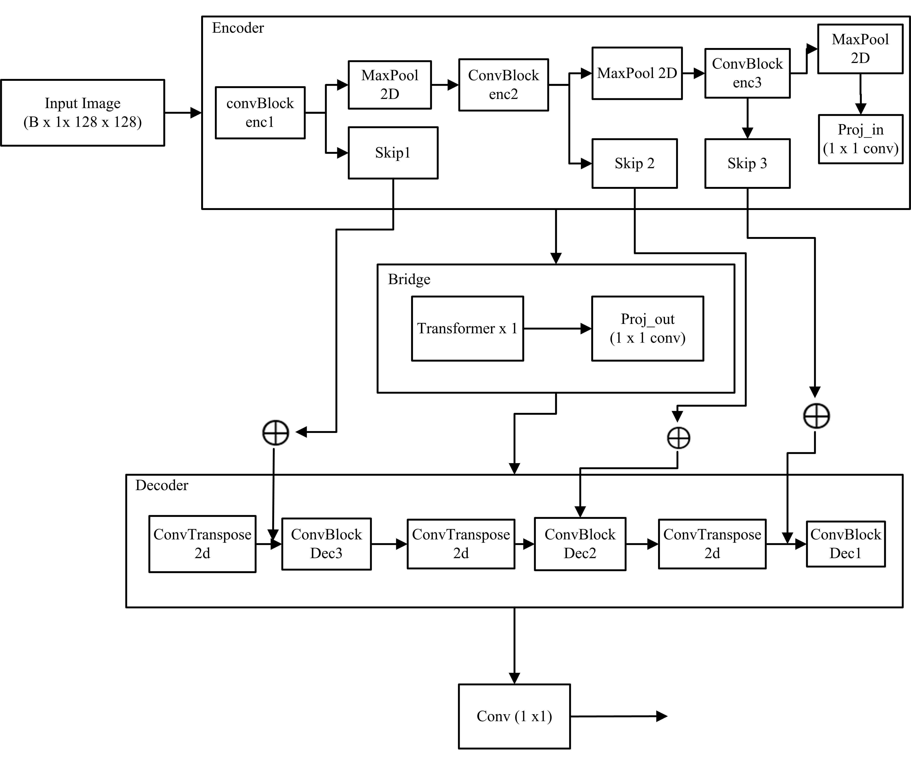

# Manga Inpainting with Transformer-U-Net (T-Former)

This repository contains the implementation of a lightweight Transformer-based U-Net (T-former) architecture for the **semantic inpainting of manga images**. The model is trained on the Manga109-s dataset using structural annotations to preserve high-frequency edges such as lines, borders, and text regions. It combines edge-aware loss, VGG-based perceptual loss, and adversarial learning in a resource-efficient framework (\~790K parameters).

---

## 👨‍💻 Authors

- **Bipin Kumar Marasini**  
  *Tribhuwan University, IOE, Nepal*

- **Ramesh Kathayat**  
  *Tribhuwan University, IOE, Nepal*


## 🔍 Project Highlights

- ⚡ **Tiny model**: Only \~790K parameters, optimized for training on limited compute.
- 🧠 **Transformer bottleneck**: Captures long-range dependencies between manga panels.
- 🎯 **Edge-preserving**: Uses edge-aware loss, multi-scale perceptual loss, and GAN training to preserve line art and structure.
- 🧪 **Masked inpainting**: Supports irregular masks based on hand- or SFX-shaped occlusions.
- 📚 **Trained on Manga109-s** with structural annotations (panels, texts, characters).

---

## 📁 Folder Structure

```
├── model/                    # Result Models (.pth)
├── Notebook/
  ├── train.ipynb                  # Model definition and Training
  ├── test.ipynb                   # Evaluation (PSNR, SSIM)
  ├── split.ipynb                  # Splitting and Visualizing the dataset
├── Results/                  # Inpainting results
└── README.md                 # Project documentation
```

---

## 🛋️ Dependencies

- Python ≥ 3.8
- PyTorch ≥ 1.12
- torchvision
- piq (for PSNR/SSIM)
- matplotlib, opencv-python
- manga109api (for annotation access)

## 🚀 Model Architecture



> **Figure:** Overview of the Transformer-U-Net (T-Former) architecture for manga inpainting.

## 🧩 Model Components

| **Component**              | **Description**                                                                                                                                         |
|----------------------------|---------------------------------------------------------------------------------------------------------------------------------------------------------|
| **Encoder**                | Four convolutional blocks with Leaky ReLU and instance normalization extract hierarchical features from masked manga images.                            |
| **Transformer Bottleneck** | A lightweight attention block processes compressed features, capturing global context efficiently.                                                      |
| **Decoder**                | Transposed convolutions upsample features. Skip connections from the encoder are averaged across channels (UNet--) to save memory.                      |
| **Discriminator**          | PatchGAN with 70×70 receptive field enforces local realism in inpainted regions.                                                                        |


- **Losses**:
  - `L1` loss for pixel accuracy
  - Edge-aware loss based on Sobel gradient difference
  - Feature Matching loss
  - Adversarial loss with global discriminator (optional patch discriminator)

---

Metrics reported:

- PSNR: \~24.5
- SSIM: \~0.93

## 📄 Citation and Acknowledgments

We use the **Manga109-s** dataset for training and evaluation. All manga images are used with respect to the original creators' copyright. Titles were randomly sampled, and authorship is acknowledged generically as per usage guidelines.

> Manga images © original authors, courtesy of the Manga109 dataset.

### Dataset References

- Aizawa, K., Fujimoto, A., Otsubo, A., Ogawa, T., Matsui, Y., Tsubota, K. and Ikuta, H., 2020. _Building a Manga Dataset “Manga109” with Annotations for Multimedia Applications_. IEEE MultiMedia, 27(2), pp.8–18. [https://doi.org/10.1109/MMUL.2020.2987895](https://doi.org/10.1109/MMUL.2020.2987895)

- Matsui, Y., Ito, K., Aramaki, Y., Fujimoto, A., Ogawa, T., Yamasaki, T. and Aizawa, K., 2017. _Sketch-based Manga Retrieval using Manga109 Dataset_. Multimedia Tools and Applications, 76(20), pp.21811–21838. [https://doi.org/10.1007/s11042-016-4020-z](https://doi.org/10.1007/s11042-016-4020-z)
